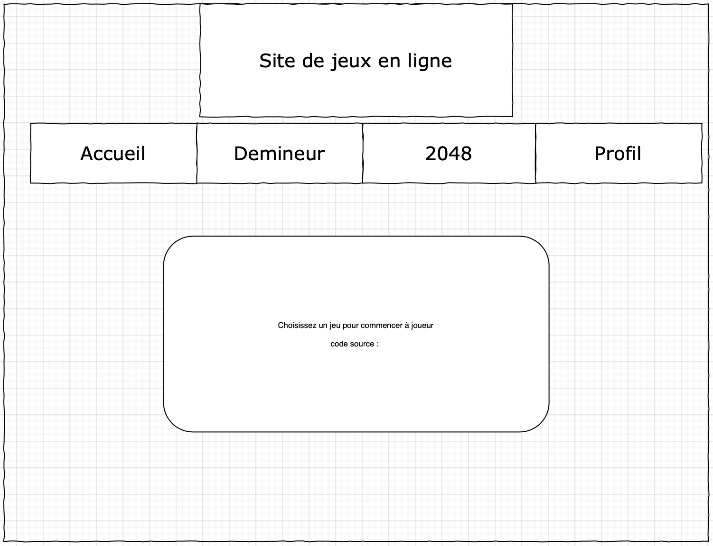
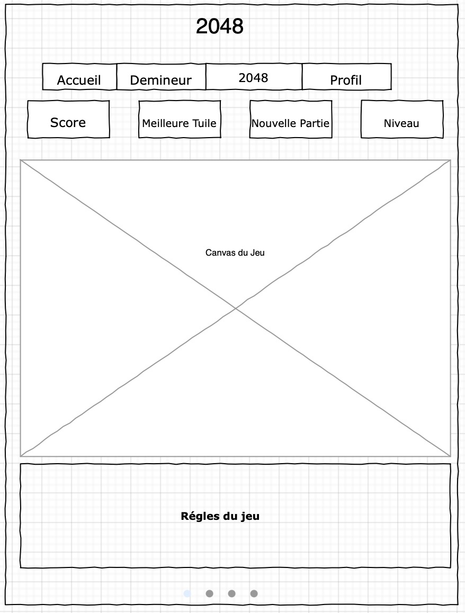
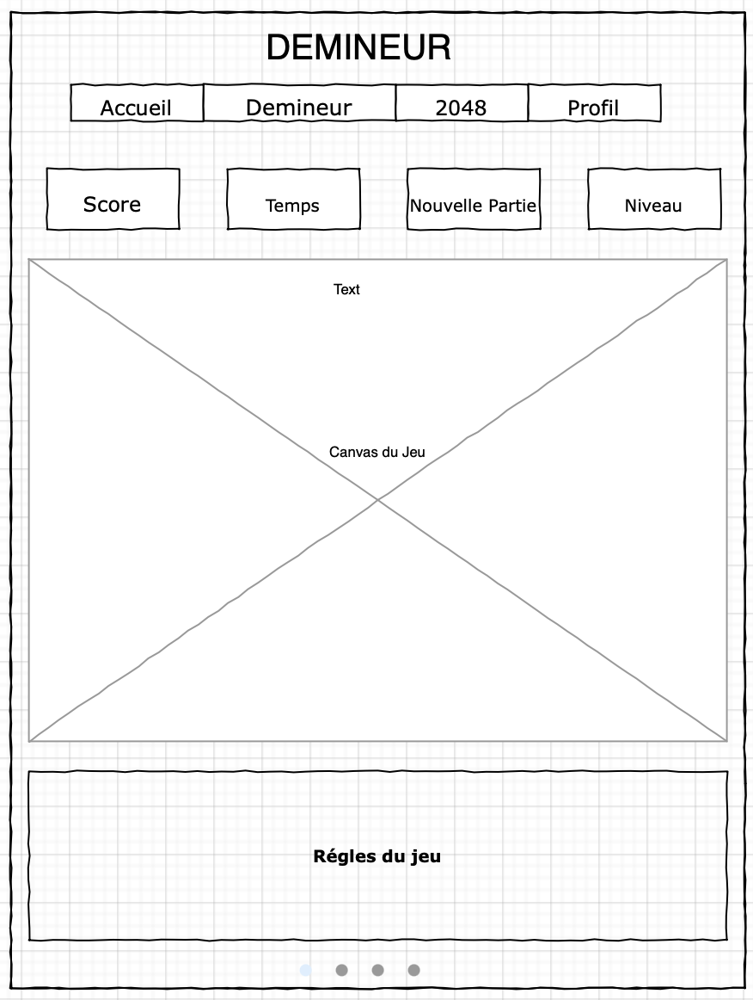
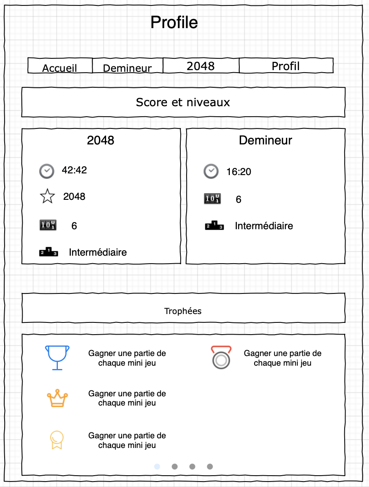

**Table of content**
- [Introduction](#introduction)
- [Organisation](#organisation)
- [Mock-up](#mock-up)
- [Detailed Architecture](#detailed-architecture)
- [Planning](#planning)

# Introduction

This Single Page Application integrates two games coded with **plain javascript** (no framework) using the [PAC](https://en.wikipedia.org/wiki/Presentation%E2%80%93abstraction%E2%80%93control) architecture. The full architecture plan is available in the [project summary here](./doc/Rapport%20Final%20projet%20Web%20-%20KUNWAR%20MAISSA.pdf).

2048 is build using only the **DOM** interface and Minesweeper uses a **Canvas**.

A *Profile* section integrates trophies, that the user can unlock during a game, and a scoreboard which are save in localStorage object.

A playable [demo is available here](https://site-de-jeux-en-ligne.netlify.app).

# Organisation

This project has been done in 5 weeks, within a team of two. A project planning has been followed during five weeks based on Agile principles : 5 itérations planned, which have been cutted in stories and then issues.

# **Hierarchical task analysis**

## General

The user must connect with a username, he can consult his profile if he has already played or choose a game. He plays as long as he wants and can go from 2048 to Minesweeper.

## 2048

US: I start a game, I can move with my arrows only if the move is allowed, tiles add up and the game ends only when I am blocked. Victory is triggered when I get a 2048 tile but I can still continue de game if I want to.

## Minesweeper

US: I start a game of minesweeper by clicking on the desired level, I first click on a box, the mines are then randomly placed after this first click so I’m not loosing on the first click. I can reveal boxes by clicking on them, as long as they are not mines. I can set a flag on a mine. The game ends when I have discovered all the squares that are not mines.

# Mock-up
             |  
:-------------------------:|:-------------------------:
  |  

# Detailed Architecture

We have chosen to apply PAC principles in order to separate logic and presentation.

**Class diagram**

This diagram helps to understand the reasoning behind the division of classes. *Ciment*‘s controller, that contains its presentation and abstraction, also contains **children that are controllers for other classes**.
This segmentation makes it possible to **regulate the communication** between child classes which must pass through the parent class.

## Navigation bar

This one, created when changing pages, allows you to navigate between the pages of the site. It is she who takes care of **emptying the container** where the page was dynamically generated. In addition, it sends the **initialization message** via cement to the controller of the page to be displayed. It takes care of removing the event listener.

## **Handling a click on the Minesweeper canvas**

Called when receiving the “init” message sent by the parent (*Ciment*), the presentation generates the HTML and gives the user a choice between three levels. Once the choice is made, the presentation calls the grid and adds the listeners to the canvas.
The diagram below shows the sequences that take place after the first click. The Grid (*Grille*) class which is part of the presentation calls a method of the presentation which manages the clicks, this one sends a message to the controller which transmits it to the abstraction. In the abstraction a 2D array containing TuileAbs represents the equivalent of the grid in the presentation.

Upon receiving this message the **abstraction randomly generates the number of mines depending on the level** and then generates the indices of the other tiles and stores them in TuileAbs.
Once the mines and the indexes have been generated, the abstraction sends a message to the controller with the index to be revealed, which transmits it to the presentation which makes it appear on the canvas.

**First click on the canvas**

When the abstraction receives the `CLIC` or `PREMIER_CLIC` message, the `tuileClicked(pos)` method is called, it finds the TuileAbs in the 2D array and determines what to do based on the tile.
A click on a tile that is not a mine produces the same sequences as `PREMIER_CLIC` except the generation of mines and indexes in the abstraction. A click on a mine produces the sequences shown in the diagram below.
But what is not shown on the diagram is that when `TuileClicked()` detects that the clicked tile is a mine, a method called ``AfficheTout()`` is called. This traverses the 2D array of TuileAbs and calls `TuileClicked()` on each tile, so this method uses recursion to reveal the entire grid.

**Click on a mine**

## **Turn management in 2048**

In the upper part of this diagram, we can see the initialization of a 2048 game: the 2048 controller receives an initialization message which it sends to its abstraction, then its abstraction communicates with the presentation via the controller.
The layout creates a `Grille2048` object. Two tiles are created by the `Grille2048`, the HTML of the grid is updated, then the game can begin.
The handlers on the arrows make it possible to trigger a turn, if it is authorized (not an illegal move). The new turn causes the placement of a new tile on the grid as well as the calculation of the **fusions of the tiles** (addition). At the end of the round, the presentation retrieves the important information of the round (score, largest tile, ...) and sends it to the controller which passes it to the presentation. The presentation decides if a victory is to be generated or not and takes care of communicating the data of the game to the profile.

## **Send data to profile, trophies and localstorage**

At each turn of 2048 or at each end of the Minesweeper game, the **games communicate with the profile**. To do so, their respective controller sends a message with an **attachment** to their parent, *Ciment*, which then forwards to the *Profil* controller.

**Data and Timer**

When a game is won / lost, for the minesweeper, or won, for the 2048, a message is sent to Profil. This message passes through *Ciment* which manages the timer. When *Ciment* sees this win/lose message passing through its controller, it **enriches the Timer attachment** that is in its presentation. Everything is received by the profile which compares the old “best” value to the one received and if the one is deemed “best”, then it replaces the old one. Ex: if we have a score of 3000 at 2048 and the old best score is 2500, 3000 becomes the new best score and is entered in localstorage.

**Trophy**

Once in the profile, the data is analyzed to find out if it gives the right to obtain a trophy (if it has not already been distributed). If this is the case, a **pop-up is displayed on the game** (during the game, for a 2048, or at the end of the game for a minesweeper) and the trophy is pushed into a list of trophies which is itself put in local storage.

# Planning

## Week 1

**User story**: I can browse the site, choose my level (minesweeper), go to Minesweeper and 2048

- Make skeletons of pages (4)
- Implementation of the Presentation-abstraction-control (PAC) template
- Make the grid of the two games and fill them
- Choice of minesweeper difficulty, generation of the grid and number of mines accordingly to the level

## Week 2

**User story**: I win Minesweeper after my first click and I can move boxes with my arrows in 2048

- Minesweeper:
    - Manage the first click on the grid
    - Generate mine spawn based of this first click
    - Uncover the boxes after this click
- 2048:
    - Randomly display the first digits
    - Move boxes with arrows

## Week 3

**User story**: I lose a game when I click on a mine and I win 2048 when I merge two boxes

- Minesweeper:
    - Generate the indexes
    - Function to manage clicks that discover a box
- 2048:
    - Function to add two boxes
    - Fusion/merge two boxes
    - Add new squares with each move

## Week 4

**User story**: I can put flags in Minesweeper, be able to check my game time and my score

- Minesweeper:
    - Display of all mines when I lose
    - Ability to put flags with right click
    - Manage Victory
    - Add victory screen
- 2048:
    - Store score
    - Manage Victory (have a 2048 box) but leave the possibility to continue
    - Pop up for victory and increase level
- Manage scores, game time, trophies with a parent class
- Create or retrieve assets for embellish the game

## Week 5

**User story**: I can consult my achievements

- User can win trophies
- Manage the appearance of trophies during the game (pop up display in the corner)
- Add trophies and stats to victory screen
